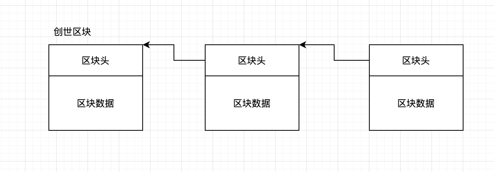
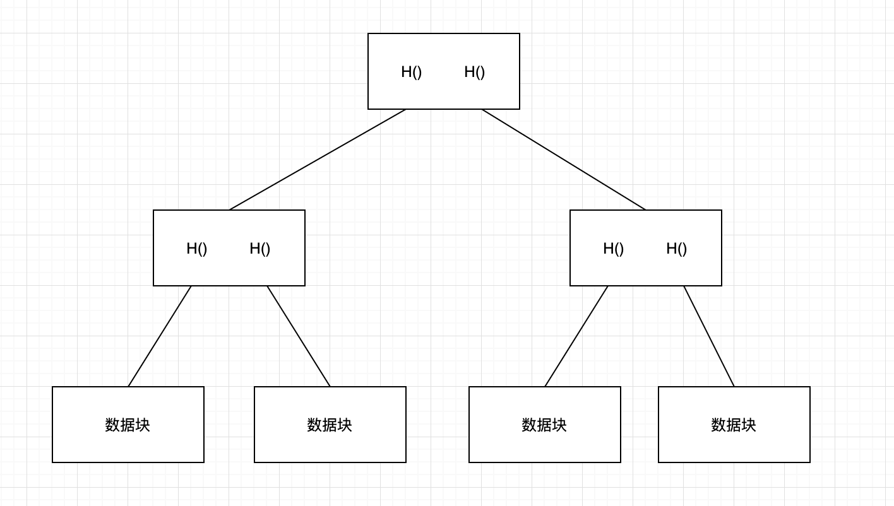
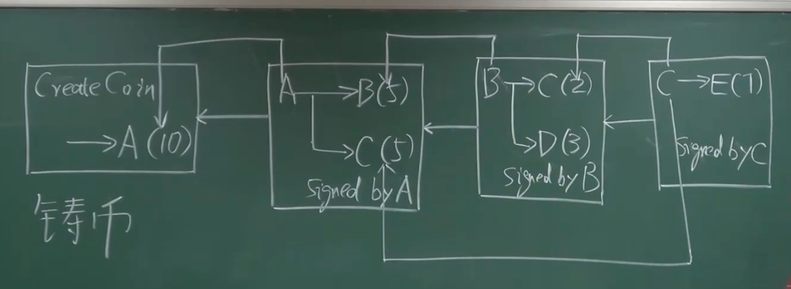
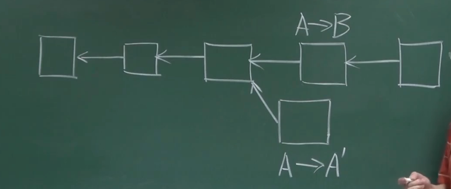
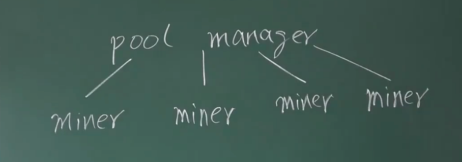

## 密码学原理
#### 哈希
`collision resistance`   
哈希碰撞客观存在， 因为输入空间范围远远大于输出空间，使得x和y不同，但满足 H(x) = H(y)的情况称为哈希碰撞  
但实际上很难构造一个y，使得它的哈希值和x的哈希值相同（md5已经被攻破），当前在用的sha256哈希算法  

`hiding`   
输出不能暴露输入，即根据H(x)不能反算出x的值，x的样本空间足够大，足够随机，没有可以攻破的规律  
如果x的输入空间比较小，需要拼接随机数，使得构造输入空间比较大，并且足够随机的输入  

`puzzle friendly`   
不能根据输入猜测到输出的结果是什么，或者输出的区间范围，这个特性保证了工作量证明的可行性  
工作量证明：找一个随机数nonce的，使得 H(区块的header) <  target，其中nonce为header中的一个字段

#### 签名
非对称加密：加解密使用不同的密钥，加密使用公钥，解密使用私钥  
对称加密：加密解密使用的是相同的密钥  

产生公私钥需要一个好的随机源，每次签名的时候也需要一个好的随机源，不然可能会造成私钥泄露

## 数据结构

#### 区块链
每个区块由区块头和区块数据组成，区块头中有一个字段`hashMerkleRoot`，记录的是当前整个区块数据的hash值   
区块头中还有另外一个字段`hashPrevBlock`，其值是前一个区块header的hash值  

区块数据就是实际的交易记录，由矿工节点收集网络上的交易记录进行打包，并计算nonce值，这个过程称为挖矿  
由于网络原因，不同矿工节点接收到的交易记录顺序不同，因此打包的数据可能差别非常大

区块链这种数据结构保证了这条链上的数据完全不可篡改，一旦发布到公链上就全部数据固定了

轻节点：只保存区块的header信息，需要使用历史区块的时候，请求其他节点获取，并通过`hashPrevBlock`字段验证  
全节点：保存区块链历史以来的所有的数据信息

block头结构

```cpp
    int32_t nVersion;
    uint256 hashPrevBlock;
    uint256 hashMerkleRoot;
    uint32_t nTime;
    uint32_t nBits;
    uint32_t nNonce;
```

<div align="center">
    
</div>

#### 默克尔树

每一个数据块计算出一个哈希值，不同两个数据块的哈希值，再组合计算出一个哈希值，最终计算根节点得到一个根节点哈希值   
这个最终的根节点哈希值就是block头结构中的hashMerkleRoot值  

<div align="center">
    
</div>

# BTC 协议

#### 双花攻击  
double spending attack，指一个货币被多次重复消费    
比特币的每个交易包括两部分，输入和输出，它们都是一段脚本，称为bitcoin script  
输入部分要说明币的来源以及其公钥，输出部分要给出收款人的公钥的哈希；  
当前交易的输入脚本，和币来源交易（前一个交易）的输出脚本，拼接在一起执行检验交易是否合法  

<div align="center">
    
</div>
  
#### 分叉攻击   
通过构造新的分叉，企图回滚掉主链上已经生效的交易记录，正常节点扩展的时候采用最长合法链  
当分叉的算力足够的时候，可能会出现其链上长度超过原来的最长合法链

如下图，A->B的转账记录已经在最长合法链上生效，A企图通过构造一个分叉生成A->A'，把主链上给B的转账记录回滚掉   

实际上在BTC的运行过程中，同时存在多条链的情况是正常的，这时候多条链竞争成为主链，最终只会有一条链胜出  
大部分节点为了避免做无用功，会自主切换到最长的链进行计算，如果当前计算的分叉链不能成为主链，最终的计算结果也是会被废弃的  

<div align="center">
    
</div>

#### 出块奖励

矿工通过打包交易记录，计算生成的nonce值，使满足条件 H(区块的header) <  target，这个称为挖矿  
优先打包成功的矿工，系统会给予记账奖励，称为铸币奖励，这使系统生成比特币的唯一方法  
除了铸币奖励，打包成功的矿工还会获得当前打包的交易记录的手续费（手续费远小于铸币奖励）    
比特币会在每打包21w个区块后，矿工打包获得的比特币奖励会减半，大约4年左右会减半  
当前约10分钟打包生成一个区块，一个小时可以打包6个区块 `21w ~= 6 * 24 * 365 * 4`  
最终所有比特币总数量 `21w * 50 * (1 + 1/2 + 1/4 + 1/8 + ...) = 2100w`

## BTC 实现

BTC采用的是基于交易的账本模式，每个区块记录的是交易信息，有转账交易和铸币交易，但系统没有显式记录每个账户的余额  
以太坊是基于账户的模式，系统会显示记录每个账户的余额

#### UTXO - Unspend Transaction Output

同一个交易，有的输出记录可能在里面，有的输出记录可能不在里面；  
比如A同时转账给B和C，但B后面把BTC转账消费掉了，最终A的交易在UTXO里面只有C的信息

UTXO集合中的每个元素要给出：  
产生这个输出的交易的的hash值，以及它在这个交易里是第几个输出，这两个信息可以定位到一条UTXO中的输出

UTXO为了检测double spending

当前BTC的挖矿算力非常大，系统为了保证10分钟出一个块，难度已经调整到非常难的程度了  
nonce只有4个字节，光是靠调整nonce大概率是没办法挖矿成功的，头部还还有两个字段可以调整的  
1.time时间，BTC不要求时间非常精准，因此时间有一定范围的调整空间  
2.merkle树的根节点哈希值，铸币交易有一个coinbase域，这个字段内容可以自行定义，然后重新生成新的merkle树  

挖矿计算的时候有两层循环，外循环调整coinbase域的内容（方法`IncrementExtraNonce`），内循环调整头部的nonce域字段  

```cpp
void IncrementExtraNonce(CBlock* pblock, const CBlockIndex* pindexPrev, unsigned int& nExtraNonce)
{
    // Update nExtraNonce
    static uint256 hashPrevBlock;
    if (hashPrevBlock != pblock->hashPrevBlock)
    {
        nExtraNonce = 0;
        hashPrevBlock = pblock->hashPrevBlock;
    }
    ++nExtraNonce;
    unsigned int nHeight = pindexPrev->nHeight+1; // Height first in coinbase required for block.version=2
    CMutableTransaction txCoinbase(*pblock->vtx[0]);
    txCoinbase.vin[0].scriptSig = (CScript() << nHeight << CScriptNum(nExtraNonce)) + COINBASE_FLAGS;
    assert(txCoinbase.vin[0].scriptSig.size() <= 100);

    pblock->vtx[0] = MakeTransactionRef(std::move(txCoinbase));
    pblock->hashMerkleRoot = BlockMerkleRoot(*pblock);
}
```

BTC缺省需要等待6个确认块才能认为交易记录最终被打包到主链上，因为可能同时存在多个分叉链，不能确定哪一条最后成为主链  
因为生成一个块需要10分钟，所以大约需要1个小时才能最终确认已经生效  
另外BTC的区块也有大小限制，单个区块不能超过1M字节，因此短时间内的交易记录可能需要等待更久才会最终写入到主链上  

## 挖矿

#### 挖矿难度

比特币每2016个区块调整一次挖矿难度，大约14天左右调整一次， ` 2016 / (24 * 10) =  14天 `  
target = target * (actual time / expected time)，其中expected time为10分钟，当实际耗时短于 10 分钟的时候，实际的target就会变小   
由工作量证明的计算公式，`H(区块的header) <  target`，target变小，则高位的0位数就越多，计算的难度就越大  

#### 挖矿历程

CPU -> GPU -> ASIC -> 矿池  

矿池逻辑   
单个全节点驱动很多的矿机，每个miner节点负责计算哈希值，全节点manager负责除哈希外的其他所有逻辑，对miner节点采用工作量证明机制  
如当前的BTC计算难度是70个0，manager则可以对矿池中miner节点采用降低难度的方式，比如要求计算60个0以上的记录进行提交给manager  
不同的miner以提交的有效记录的数量作为自己的工作量证明，当矿池对BTC挖矿成功的时候，就按miner的实际工作量进行分配收益  
这种方式又叫`share: almost valid block`，这些提交的nonce除了作为工作量证明外，没有其他意义   

<div align="center">
    
</div>


