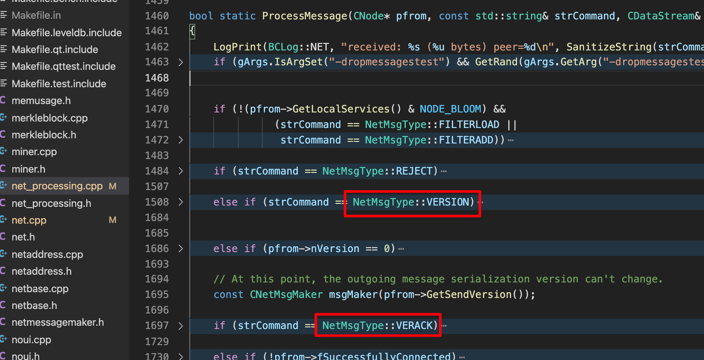
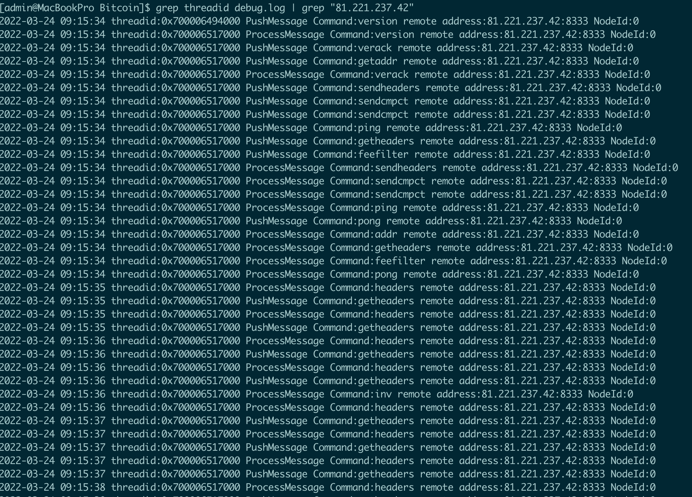

# 核心代码流程

### main方法调用了AppInit初始化  

### AppInit方法中定义了两个重要的变量    
```c++ 
boost::thread_group threadGroup;  
CScheduler scheduler;  
```
### AppInit方法内调用AppInitMain方法  

### AppInitMain方法内部逻辑 
- 进行启动相关的初始化操作  
- 启动线程 ThreadScriptCheck  
- 启动线程 scheduler，线程的函数是 CScheduler::serviceQueue()  
- 启动线程 ThreadImport   
- 启动线程 TorControlThread，洋葱线程  
- 创建对象 g_connman（连接管理者），最后调用了connman.Start 

### connman.Start 启动了多个线程对象 

（1）std::thread threadDNSAddressSeed;  

dns线程，初始化来获取dns的地址  

（2） std::thread threadSocketHandler;

本地网络IO线程，启动监听8333端口，以及处理基于该端口上的连接，连接建立后存储进vNodes成员中      
监听vNodes中的所有网络事件，进行网络收发处理，使用select事件进行驱动      

（3） std::thread threadOpenAddedConnections;  

增加节点线程，可以通过配置或者命令行的方式自行添加节点，添加的节点在建立连接后保存到vNodes中  

（4） std::thread threadOpenConnections;   

打开连接线程，为addr建立连接，主要是为dns获取到的地址建立连接    
在OpenNetworkConnection的时候，为每个节点创建一个CNode对象，对象中存储了height高度，初始情况下都是0   
同时 m_msgproc->InitializeNode(pnode); 进行PushNodeVersion发送version handshake握手   
建立连接的时候将socket设置为非阻塞模式      

（5）std::thread threadMessageHandler;   

消息处理线程，接收vNodes对象每个节点的消息，以及发送消息     
这里有两类消息，一个是作为客户端向其他bitcoin节点请求的消息以及响应，一类是作为服务端处理其他bitcoin客户端的请求以及响应    

比如ProcessMessage函数这里的VERSION是作为服务端接收其他bitcoin的VERSION握手请求，然后响应VERACK请求   
作为客户端，给其他节点发送VERSION请求，然后接收其他节点的VERACK响应   

<div align="center">
    
</div>

<br>

# 消息结构
包括消息头和消息体，消息头有4部分：   
消息的MAGIC，长度4个字节，内容从低位到高位分别是：0x0b,0x11,0x09,0x07    
消息命令字，12字节    
消息体大小，4字节    
checksum，4字节    

```c++
class CMessageHeader
{
    //
    //
    char pchMessageStart[MESSAGE_START_SIZE]; //4 byte
    char pchCommand[COMMAND_SIZE];            //12 byte 
    uint32_t nMessageSize;                    //4 byte
    uint8_t pchChecksum[CHECKSUM_SIZE];       //4 byte
}
```

消息体就是实际的消息数据，不同协议的消息体数据大小不一样，协议由头部的pchCommand指定，大小由头部的nMessageSize指定   
<br>

# TCP数据流处理

tcp字节流解析由`ThreadSocketHandler`线程方法实现，使用`select`进行事件驱动，监听所有`socket`的上的读写事件    
当发生读事件的时候，`pnode->ReceiveMsgBytes`负责读取解析完整的数据包，读取到的数据包存储到`pnode->vRecvMsg`中    
该`vRecvMsg`成员中的包并不一定是完整的包，不完整的包需要下一次继续解析处理，如果数据包是完整的    
那么将会存储进`pnode->vProcessMsg`中，`vProcessMsg`中的数据包将会由消息处理线程来处理    
另外一个发送消息的处理，主要将node节点的待发送队列的数据发送到socket上  

```c++
// typical socket buffer is 8K-64K
char pchBuf[0x10000];
int nBytes = 0;
{
    LOCK(pnode->cs_hSocket);
    if (pnode->hSocket == INVALID_SOCKET)
        continue;
    nBytes = recv(pnode->hSocket, pchBuf, sizeof(pchBuf), MSG_DONTWAIT);
}
if (nBytes > 0)
{
    bool notify = false;
    if (!pnode->ReceiveMsgBytes(pchBuf, nBytes, notify))
        pnode->CloseSocketDisconnect();
    RecordBytesRecv(nBytes);
    if (notify) {
        size_t nSizeAdded = 0;
        auto it(pnode->vRecvMsg.begin());
        for (; it != pnode->vRecvMsg.end(); ++it) {
            if (!it->complete())
                break;
            nSizeAdded += it->vRecv.size() + CMessageHeader::HEADER_SIZE;
        }
        {
            LOCK(pnode->cs_vProcessMsg);
            pnode->vProcessMsg.splice(pnode->vProcessMsg.end(), pnode->vRecvMsg, pnode->vRecvMsg.begin(), it);
            pnode->nProcessQueueSize += nSizeAdded;
            pnode->fPauseRecv = pnode->nProcessQueueSize > nReceiveFloodSize;
        }
        WakeMessageHandler();
    }
}
```

# 消息处理

`ThreadMessageHandler`线程依次对每一个node节点进行处理，处理消息使用`ProcessMessages`，发送消息使用`SendMessages`      
在这里处理的消息保证都是一个完整的消息，是经过前面对TCP数据流解析完之后的完整消息；接收到对端的消息经过处理后，需要发送的数据存储    
在node对象的变量中，下一个阶段通过`SendMessages->PushMessage`来发送，这时候数据是存入到待发送队列中，由tcp处理线程进行实际的发送    
特别的如果发送队列为空，那么就直接调用socket发送，这时候是不存入到队列中的   

```c++
void CConnman::ThreadMessageHandler()
{
    // ...
    //
    for (CNode* pnode : vNodesCopy)
    {
        if (pnode->fDisconnect)
            continue;

        // Receive messages
        bool fMoreNodeWork = m_msgproc->ProcessMessages(pnode, flagInterruptMsgProc);
        fMoreWork |= (fMoreNodeWork && !pnode->fPauseSend);
        if (flagInterruptMsgProc)
            return;
        // Send messages
        {
            LOCK(pnode->cs_sendProcessing);
            m_msgproc->SendMessages(pnode, flagInterruptMsgProc);
        }

        if (flagInterruptMsgProc)
            return;
    }
    //
   // ...
}
```

`ProcessMessages`消息内部，对于每个节点，每次只从`pfrom->vProcessMsg`中取一个消息，进行检验判断后调用`ProcessMessage`处理   
`ProcessMessage`函数内部，根据`strCommand`的业务类型，进行相应的逻辑处理

```c++
std::list<CNetMessage> msgs;
{
    LOCK(pfrom->cs_vProcessMsg);
    if (pfrom->vProcessMsg.empty())
        return false;
    // Just take one message
    msgs.splice(msgs.begin(), pfrom->vProcessMsg, pfrom->vProcessMsg.begin());
    pfrom->nProcessQueueSize -= msgs.front().vRecv.size() + CMessageHeader::HEADER_SIZE;
    pfrom->fPauseRecv = pfrom->nProcessQueueSize > connman->GetReceiveFloodSize();
    fMoreWork = !pfrom->vProcessMsg.empty();
}
CNetMessage& msg(msgs.front());

// ...

// Process message
bool fRet = false;
try
{
    fRet = ProcessMessage(pfrom, strCommand, vRecv, msg.nTime, chainparams, connman, interruptMsgProc);
    if (interruptMsgProc)
        return false;
    if (!pfrom->vRecvGetData.empty())
        fMoreWork = true;
}
```

# 业务交互

如下图是local端和某个remote peer的交互数据包逻辑，这里打印了部分交互请求

<div align="left">
    
</div>

<div align="left">
    
</div>

双方都互发VERSION是因为作为服务端的remote节点，接收到local节点的VERSION的时候  
在响应VERACK之前，会先发送一个VERSION给对方，这样通信双方都会有VERSION的交互   

在VERSION交互完毕之后，在给对端发送VERACK的逻辑后面，紧接着local端会先发起一个getaddr的请求   
对端在接收到getaddr请求后将待发送的地址列表保存到vAddrToSend成员中，下一个阶段的`SendMessages`的进行数据发送

后面的sendheaders以及sendcmpct请求，这几个消息受VERSION消息驱动，对端接收到之后只是设置状态，并没有响应返回   


```c++
// Be shy and don't send version until we hear
if (pfrom->fInbound)
    PushNodeVersion(pfrom, connman, GetAdjustedTime());

connman->PushMessage(pfrom, CNetMsgMaker(INIT_PROTO_VERSION).Make(NetMsgType::VERACK));

//...

// Get recent addresses
if (pfrom->fOneShot || pfrom->nVersion >= CADDR_TIME_VERSION || connman->GetAddressCount() < 1000)
{
    connman->PushMessage(pfrom, CNetMsgMaker(nSendVersion).Make(NetMsgType::GETADDR));
    pfrom->fGetAddr = true;
}
```

```c++
//
// Message: addr
//
if (pto->nNextAddrSend < nNow) {
    pto->nNextAddrSend = PoissonNextSend(nNow, AVG_ADDRESS_BROADCAST_INTERVAL);
    std::vector<CAddress> vAddr;
    vAddr.reserve(pto->vAddrToSend.size());
    for (const CAddress& addr : pto->vAddrToSend)
    {
        if (!pto->addrKnown.contains(addr.GetKey()))
        {
            pto->addrKnown.insert(addr.GetKey());
            vAddr.push_back(addr);
            // receiver rejects addr messages larger than 1000
            if (vAddr.size() >= 1000)
            {
                connman->PushMessage(pto, msgMaker.Make(NetMsgType::ADDR, vAddr));
                vAddr.clear();
            }
        }
    }
    pto->vAddrToSend.clear();
    if (!vAddr.empty())
        connman->PushMessage(pto, msgMaker.Make(NetMsgType::ADDR, vAddr));
    // we only send the big addr message once
    if (pto->vAddrToSend.capacity() > 40)
        pto->vAddrToSend.shrink_to_fit();
}
```

在函数SendMessage里面，有一个重要的逻辑，就是同步block数据块的处理，前面时序流中红色的请求    
local端发送getheaders请求，remote端发送headers响应

```c++
// Start block sync
if (pindexBestHeader == nullptr)
    pindexBestHeader = chainActive.Tip();
bool fFetch = state.fPreferredDownload || (nPreferredDownload == 0 && !pto->fClient && !pto->fOneShot); // Download if this is a nice peer, or we have no nice peers and this one might do.
if (!state.fSyncStarted && !pto->fClient && !fImporting && !fReindex) {
    // Only actively request headers from a single peer, unless we're close to today.
    if ((nSyncStarted == 0 && fFetch) || pindexBestHeader->GetBlockTime() > GetAdjustedTime() - 24 * 60 * 60) {
        state.fSyncStarted = true;
        state.nHeadersSyncTimeout = GetTimeMicros() + HEADERS_DOWNLOAD_TIMEOUT_BASE + HEADERS_DOWNLOAD_TIMEOUT_PER_HEADER * (GetAdjustedTime() - pindexBestHeader->GetBlockTime())/(consensusParams.nPowTargetSpacing);
        nSyncStarted++;
        const CBlockIndex *pindexStart = pindexBestHeader;
        /* If possible, start at the block preceding the currently
            best known header.  This ensures that we always get a
            non-empty list of headers back as long as the peer
            is up-to-date.  With a non-empty response, we can initialise
            the peer's known best block.  This wouldn't be possible
            if we requested starting at pindexBestHeader and
            got back an empty response.  */
        if (pindexStart->pprev)
            pindexStart = pindexStart->pprev;
        LogPrint(BCLog::NET, "initial getheaders (%d) to peer=%d (startheight:%d)\n", pindexStart->nHeight, pto->GetId(), pto->nStartingHeight);
        connman->PushMessage(pto, msgMaker.Make(NetMsgType::GETHEADERS, chainActive.GetLocator(pindexStart), uint256()));
    }
}
```


